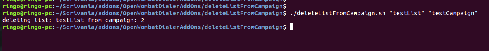
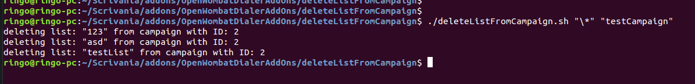
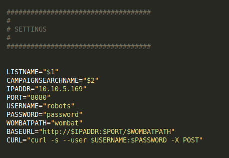

Delete List From Campaign Script
--------------------------------------------

This script is intended to be used together with WombatDialer. It allows the user to easily delete lists attached to a particular campaign. Please note that this will not affect running campaigns, but will affect every new campaign run for that particular campaign.

USAGE
---------

To remove a list from a campaign, you can pass the list name and campaign name as parameters.

./deleteListFromCampaign "testList" "testCampaign"

  

Alternatively you can leave each parameter empty, and you will be prompted to a menu, where you can select the desired list or campaign.

 

To remove all lists from one campaign you can type "\*" as your list name. This will make sure that all the lists attached to a campaign are removed.

 

SETUP
--------

To set up this script you can open it with a text-editor and edit the SETTINGS fields at the beginning.

 

In particular you will need to edit the 

- IPADDR

- PORT

- USERNAME

- PASSWORD

Fields.